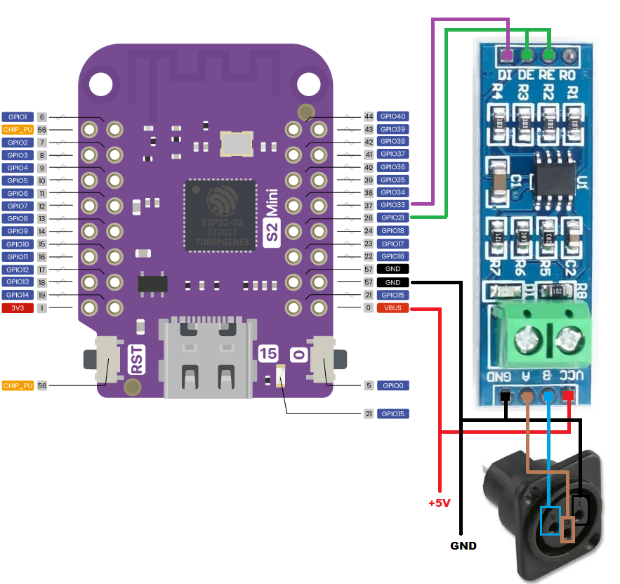

# ESP32-Artnet2DMX
A converter that takes Artnet data packets and converts them to DMX output.

# WARNING
**You attempt any of this at your own risk**

## Build the device
### Hardware Used

ESP32-S2 Mini Lolin

MAX485 TTL to RS485

3 pin XLR female panel mount 

### Wiring it up

|POWER |ESP32 S2 Mini | MAX485 | DMX OUT (Female connector) |
|:---|:-:|:-:|:-:|
|GND | GND | GND | PIN 1 |
|VBUS | 5V | VCC | Not connected |
|  | GPIO for Enable | DE & RE | Not connected |
|  | GPIO for Transmit | DI | Not connected |
|  | GPIO for Receive | Not connected | Not connected |
|  |  | OUTPUT A | PIN 3  (Data +) |
|  |  | OUTPUT B | PIN 2  (Data -) |

### Setting it up

Download the Arduino IDE.
WARNING: DO NOT POWER THE ESP32 FROM AN EXTERNAL SOURCE UNTIL THE ESP32 HAS BEEN DISCONNECTED FROM PC.

YOU - HAVE - BEEN - WARNED!

Open the 'ESP32-Artnet2DMX.ino' file.

Click "Tools" -> "Manage Libraries.." then search and install :-
 - esp_dmx (Tested version 4.1.0)
 - ArduinoJson (Tested version 7.1.0)

Now connect the ESP32-S2 mini via USB to a PC.

On the ESP32-S2 hold the "0" button down and then press the "RST" button, then let go of the "0" button. This puts the device into program/flash mode.
In the Arduino IDE click "Sketch" then "Upload", now wait for the program to compile & upload to the ESP32.

You will see a lot of % output until it gets to 100%, then it will complain about not being able to reset the device & give an error.  Don't worry, this is normal :)
Now disconnect the USB from ESP32 so that it's no longer connected to the PC and then power it by your PSU/Battery pack.

Connect a device (phone/pc) to the WiFi hotspot "ESP32_ArtNet2DMX" using the passcode "1234567890".

Using a webbrowser go to "http://192.168.1.1/" and a setup screen will appear with 3 options 'WiFi' 'ESP32 Pins' & 'Art-Net 2 DMX'.

Enter the WiFi screen and enter in your local WiFi details in WiFi SSID & Password.
If your network has DHCP then check with your router which IP it will get from the MAC, or enter in manually a static IP & Subnet.
Clicking 'SUBMIT' on this screen will restart the ESP32 and it will attempt to connect to your network, if it fails then the hotspot will re-appear.

The 'ESP32 Pins' screen allows you to change the pins if you are using a different ESP - Note: I've only tested this with an ESP32-S2 Lolin.

The 'Art-Net 2 DMX' screen allows you to change the Art-Net universe to convert to DMX.  All other universes are ignored.

Here are the default settings.
|Setting | GPIO Default | Note |
|:---|:-:|:-:|
|GPIO Enable | 21 | Connects to DE & RE on MAX485 |
|GPIO Transmit | 33 | Connects to DI on MAX485 | 
|GPIO Receive | 38 | Ensure nothing is connected to this GPIO |
|Artnet Universe | 1 | The Artnet universe to listen for, all other universes are ignored |

# Art-Net

Art-Net(tm) is a trademark of Artistic Licence Holdings Ltd. The Art-Net protocol and associated documentation is copyright Artistic Licence Holdings Ltd.

[Art-Net](https://art-net.org.uk/)
