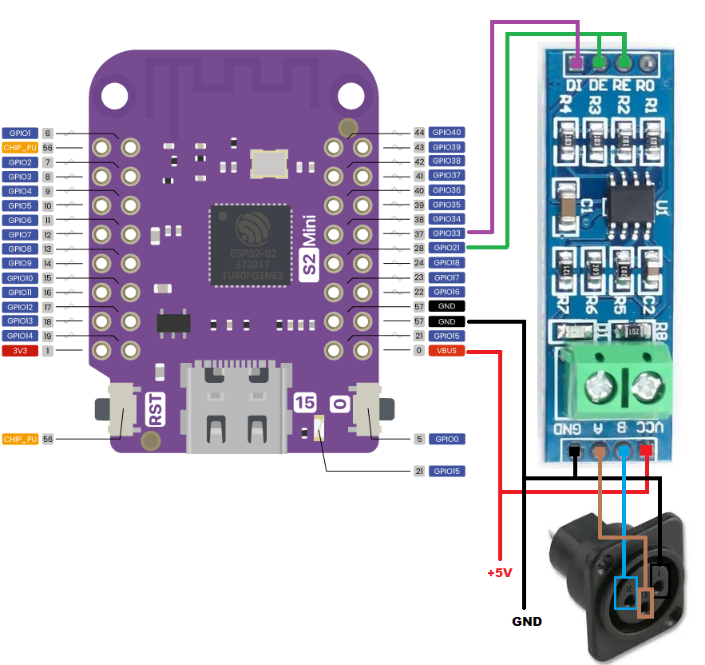

# ESP32-Artnet2DMX
A converter that takes Artnet data packets and converts them to DMX output.

# WARNING
**You attempt any of this at your own risk**

## Build the device
### Hardware Used

ESP32-S2 Mini Lolin

MAX485 TTL to RS485

3 pin XLR female panel mount 

### Wiring it up

|POWER |ESP32 S2 Mini | MAX485 | DMX OUT (Female connector) |
|:---|:-:|:-:|:-:|
|GND | GND | GND | PIN 1 |
|VBUS | 5V | VCC | Not connected |
|  | GPIO for Enable | DE & RE | Not connected |
|  | GPIO for Transmit | DI | Not connected |
|  | GPIO for Receive | Not connected | Not connected |
|  |  | OUTPUT A | PIN 3  (Data +) |
|  |  | OUTPUT B | PIN 2  (Data -) |

### Setting it up

Download the Arduino IDE.
WARNING: DO NOT POWER THE ESP32 FROM AN EXTERNAL SOURCE UNTIL THE ESP32 HAS BEEN DISCONNECTED FROM PC.

YOU - HAVE - BEEN - WARNED!

Open the 'ESP32-Artnet2DMX.ino' file.

Click "Tools" -> "Manage Libraries.." then search and install :-
 - esp_dmx (Tested version 4.1.0)
 - ArduinoJson (Tested version 7.1.0)

Now connect the ESP32-S2 mini via USB to a PC.

On the ESP32-S2 hold the "0" button down and then press the "RST" button, then let go of the "0" button. This puts the device into program/flash mode.
In the Arduino IDE click "Sketch" then "Upload", now wait for the program to compile & upload to the ESP32.

You will see a lot of % output until it gets to 100%, then it will complain about not being able to reset the device & give an error.  Don't worry, this is normal :)
Now disconnect the USB from ESP32 so that it's no longer connected to the PC and then power it by your PSU/Battery pack.

Connect a device (phone/pc) to the WiFi hotspot "ESP32_ArtNet2DMX" using the passcode "1234567890".

Using a webbrowser go to "http://192.168.1.1/" and a setup screen will appear with multiple options.

Enter the WiFi screen and enter in your local WiFi details in WiFi SSID & Password.
If your network has DHCP then check with your router which IP it will get from the MAC, or enter in manually a static IP & Subnet.
Clicking 'SUBMIT' on this screen will restart the ESP32 and it will attempt to connect to your network, if it fails then the hotspot will re-appear.

The 'ESP32 Pins' screen allows you to change the pins if you are using a different ESP - Note: I've only tested this with an ESP32-S2 Lolin.

The 'Art-Net 2 DMX' screen allows you to change the Art-Net universe to convert to DMX.  All other universes are ignored.

Here are the default settings.
|Setting | GPIO Default | Note |
|:---|:-:|:-:|
|GPIO Enable | 21 | Connects to DE & RE on MAX485 |
|GPIO Transmit | 33 | Connects to DI on MAX485 | 
|GPIO Receive | 38 | Ensure nothing is connected to this GPIO |
|Artnet Universe | 1 | The Artnet universe to listen for, all other universes are ignored |

The 'Channel Mods' screen allow you to change the values that are sent to DMX using modifiers.  This is helpful if you have different light units on different channels and want to have them slightly different.

| Mod Type | Note |
|:--|:-:|
|Equals Value | Assigns a given value to that channel |
|Add Value | Adds a given value to the existing channel value |
|Minus Value | Minuses a given value to the existing channel value |
|Copy From Value | Copy the value from a given channel to this DMX channel |
|Add From Channel | Add the value from a given channel to this DMX channel |
|Minus From Channel | Minus the value from a given channel to this DMX channel |
|Only Add if value above 0 | Adds the given value if the current channel value is above 0 |
|Only Minus if value above 0 | Minuses the given value if the current channel value is above 0 |
|Copy from Art-Net channel | Copys the given Art-Net channel data into the DMX output channel |
|Add from Art-Net channel | Adds the given Art-Net channel data into the DMX output channel |
|Minus from Art-Net channel | Minuses the given Art-Net channel data from this DMX output channel |
|If 0, add from Art-Net channel | If this current DMX channel data is zero, then adds the given Art-Net channel data into this DMX channel |

Notes:
  - Channel mods are applied in channel order starting from channel 1.  So if you mod channel 1 and then copy channel 1 to channel 10, then channel 10 will also have the channel 1 mod applied.
  - It's advisable to disable DMX output whilst setting up, otherwise there might be a slowdown in the web response.
  - To help reduce any potential packetloss, ensure that your Art-Net sender is sending directly to the IP of the device.

### Updated 12th July 2024 (Pt.1)
 - Changed default timeout to 3000 ms for Artnet data.
 - Added button to disable DMX output, which is useful when setting up.
 - Added 'Channel Mods'.  This allows channel values to be changed in real-time.

### Updated 12th July 2024 (Pt.2)
 - Fixed channel mods, they now apply in channel order starting from 1.
   
### Updated 15th July 2024
 - Added 2 channel value modifiers
 - Channel mods setup page now lists channels that have mods with quick edit & remove buttons.
 - Fixed bug where device mac wasn't always showing on the WiFi setup page.

### Updated 1st August 2024
 - Code cleaned up a little.
 - Added even more channel value modifiers.
 - Added a button to enable or disable Art-Net data copy into the DMX data.  Art-Net data can now be assigned with the new mods into the DMX channels.
 - Added channel mod config download & upload.

### Example of it in action (Click image to see it on YouTube)

# Art-Net

Art-Net(tm) is a trademark of Artistic Licence Holdings Ltd. The Art-Net protocol and associated documentation is copyright Artistic Licence Holdings Ltd.

[Art-Net](https://art-net.org.uk/)
